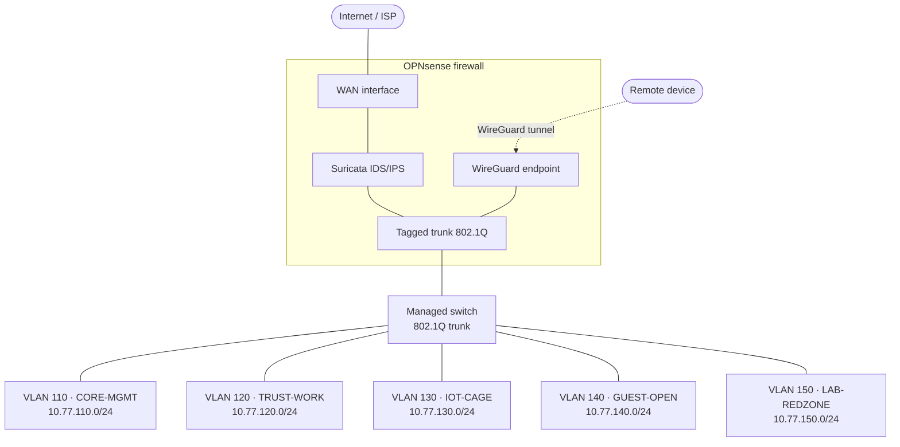

# Segmented Home Network with OPNsense

> **Status:** In progress — hardware deployed, configuration underway.
> Sections marked _Planned_ describe design decisions that are not yet implemented.

Rebuilding a flat, ISP-router-managed home network into a segmented network with an explicit trust model, default-deny inter-segment policy, network intrusion detection, and key-based remote access.

The goal is not "more security appliances." It is **containment**: making sure that a device which is eventually compromised — and on a network with consumer IoT, one eventually will be — cannot reach anything of value.

> **Note on the details below.** VLAN identifiers, names and addressing in this document are illustrative and do not correspond to the deployed network. They are included because a segmentation design is unreadable without concrete examples. See [What is deliberately not published](#what-is-deliberately-not-published).

---

## Threat model

The design starts from what actually lives on the network, and what each category realistically does when it goes wrong.

| Asset / actor | Concern |
| :--- | :--- |
| IoT devices (cameras, TV, smart plugs) | Vendor firmware that stops receiving patches, hardcoded credentials, chatty outbound telemetry, and no way to harden the device itself |
| Guest devices | Unknown patch level and unknown hygiene; treated as hostile by default |
| Lab / pentest VMs | Deliberately run offensive tooling and intentionally vulnerable targets; must never touch anything else |
| Work endpoint | Handles consultancy material; the segment that everything else must be kept away from |
| Firewall management plane | Full control of the network — compromise here makes every other control irrelevant |

On a flat network every one of these shares a broadcast domain, which means a single compromised device has layer-2 adjacency to all the others. ARP spoofing, mDNS/SSDP discovery, SMB enumeration and lateral movement all become trivial. Segmentation removes that adjacency; the firewall then decides what — if anything — is allowed to cross.

**Design principles**

1. **Default deny between segments.** Nothing crosses a VLAN boundary unless a rule explicitly permits it.
2. **The management plane is the crown jewel.** It is reachable from one segment only, never from wireless, never from the internet.
3. **Egress is filtered too.** Outbound is not automatically trustworthy — it is how implants call home and how IoT devices exfiltrate.
4. **Log the denies.** A rule that silently drops traffic teaches you nothing; a logged drop is a detection source.

---

## Architecture

---

## Segmentation model

| VLAN | Name | Subnet | Contents | Internet | Inter-VLAN |
| :---: | :--- | :--- | :--- | :---: | :--- |
| 110 | `CORE-MGMT` | 10.77.110.0/24 | Firewall GUI, switch, AP management | Restricted | Reachable from `TRUST-WORK` only |
| 120 | `TRUST-WORK` | 10.77.120.0/24 | Workstation, NAS, printer | Yes | May initiate to `CORE-MGMT`; nothing may initiate inbound |
| 130 | `IOT-CAGE` | 10.77.130.0/24 | Cameras, TV, smart home devices | Filtered | None — no LAN access in either direction |
| 140 | `GUEST-OPEN` | 10.77.140.0/24 | Visitor devices | Yes | None; client isolation enabled at the AP |
| 150 | `LAB-REDZONE` | 10.77.150.0/24 | Pentest VMs, intentionally vulnerable targets | _Planned:_ restricted | None — isolated in both directions |
| — | `WG-PEERS` | 10.77.200.0/24 | Remote access tunnel endpoints | Yes | Per-peer, scoped individually |

**Naming and addressing convention.** The VLAN ID is carried into the third octet, so `10.77.130.x` is unambiguously VLAN 130 without consulting a table. Names encode intent rather than hardware — `IOT-CAGE` and `LAB-REDZONE` state the trust posture, which makes a misplaced firewall rule visible at a glance during review. Each VLAN maps to its own firewall interface, its own DHCP scope, and — for the wireless segments — its own SSID.

---

## Firewall policy

Traffic flow between segments, expressed as a matrix. Rows initiate, columns receive.

| From ↓ / To → | CORE-MGMT | TRUST-WORK | IOT-CAGE | GUEST-OPEN | LAB-REDZONE | WAN |
| :--- | :---: | :---: | :---: | :---: | :---: | :---: |
| **CORE-MGMT** | — | ✗ | ✗ | ✗ | ✗ | Limited |
| **TRUST-WORK** | ✓ | — | Selected | ✗ | ✓ | ✓ |
| **IOT-CAGE** | ✗ | ✗ | — | ✗ | ✗ | Filtered |
| **GUEST-OPEN** | ✗ | ✗ | ✗ | — | ✗ | ✓ |
| **LAB-REDZONE** | ✗ | ✗ | ✗ | ✗ | — | Planned |

**Rule construction**

- Every interface ends in an explicit logged deny, so nothing falls through to an implicit rule whose behaviour has to be remembered rather than read.
- Rules are written against aliases (host groups, port groups) rather than literal addresses, which keeps the ruleset readable and makes changes auditable.
- DNS is redirected to the firewall's resolver with a NAT rule, so devices that ship with hardcoded upstream resolvers cannot bypass local DNS policy.
- Outbound is restricted to the ports each segment actually needs. IoT devices that require nothing but HTTPS and NTP get nothing but HTTPS and NTP.
- Anti-lockout is handled deliberately: a management path is verified before the deny rules covering it are enabled.

The "Selected" entry from `TRUST-WORK` to `IOT-CAGE` covers the small number of flows that make smart-home devices usable at all — casting and controller traffic — permitted per destination and port rather than as a blanket allow.

---

## Platform

| Component | Class | Rationale |
| :--- | :--- | :--- |
| Firewall appliance | Fanless x86-64 appliance with AES-NI | Hardware AES is effectively mandatory once VPN throughput matters |
| NICs | Intel server-class NICs | Mature FreeBSD driver support, higher throughput at lower CPU load than Realtek equivalents |
| Switch | Managed switch with 802.1Q support | VLAN tagging is the prerequisite for the entire design |
| Access point | Multi-SSID AP with per-SSID VLAN mapping and client isolation | Wireless segments must terminate in the same trust model as wired ones |
| OS | OPNsense (FreeBSD-based) | Open source, native Suricata and WireGuard integration, unlocked hardware |

Sizing note: packet filtering itself is cheap. What consumes CPU is Suricata in inline mode with a large ruleset, so the platform was chosen against that workload rather than against raw routing throughput.

---

## Intrusion detection

Suricata runs on the firewall, with rules from the Emerging Threats Open ruleset supplemented by abuse.ch feeds.

**Placement.** Inspection is applied where traffic is already decapsulated and pre-NAT, so alerts carry the internal source address rather than the translated one. An alert that says "something inside is beaconing" is only actionable if it also says *which host*.

**Mode.** Starting in IDS (alert-only) mode. Moving to inline blocking before the ruleset has been tuned is how you take down your own network with a false positive on a Tuesday morning — the alert stream is being observed first, then noisy or irrelevant signatures are suppressed or disabled, and only then is blocking enabled per category.

**Tuning approach.** Rule categories are enabled deliberately rather than wholesale. Each suppression is recorded with the reason it was added, so the ruleset is a documented decision trail rather than an accumulation of things that were annoying at some point. The suppression list itself stays internal — a published list of what a sensor deliberately ignores is a map for anyone who wants to avoid it.

**Limitation, stated honestly.** The majority of traffic is TLS-encrypted, so payload inspection sees far less than a rule count suggests. What still works is metadata: JA3/JA4 fingerprints, SNI, DNS queries, connections to known-bad infrastructure, and beaconing patterns. This is a detection layer, not a guarantee.

---

## Remote access

WireGuard is used for remote access to the network.

**Why WireGuard over OpenVPN:** a considerably smaller codebase and therefore a smaller attack surface, kernel-space performance, modern cryptography with no negotiable cipher suites to misconfigure, and a key model simple enough that it is hard to get wrong.

**Design decisions**

- One key pair per device. Revoking access to a lost phone means removing one peer, not reissuing credentials to everything.
- Remote peers terminate in a dedicated range (`10.77.200.0/24` in the illustration above) and are subject to firewall rules like any other segment — connecting to the VPN grants network reachability, not trust.
- No inbound port forwards to internal hosts. The WireGuard endpoint is the only listening service exposed to the internet, and it does not respond to unauthenticated packets, so it does not appear in a port scan as an open service.
- `AllowedIPs` on each peer is scoped to what that device actually needs to reach — a phone that needs the NAS does not get a route to `CORE-MGMT`.
- Private keys are generated on the device that will use them and never transit the firewall.

---

## Verification

A configuration that has not been tested is an assumption. Each control is verified from the position of a would-be attacker rather than from the admin's chair.

| Control | Verification |
| :--- | :--- |
| VLAN isolation | Host discovery and port scanning from a device in each segment; expected result is that only permitted destinations respond |
| Management plane | Confirm the firewall GUI is unreachable from `IOT-CAGE`, `GUEST-OPEN` and `LAB-REDZONE`, and from the WAN side |
| DNS redirection | Query an external resolver directly and confirm the response still comes from the local resolver |
| Egress filtering | Attempt outbound connections on non-permitted ports from `IOT-CAGE`; confirm the deny is logged |
| Suricata | Generate controlled test traffic against a known signature and confirm the alert appears with the correct internal source address |
| WireGuard | Confirm handshake, confirm the peer can reach only its permitted destinations, confirm a removed peer is genuinely denied |
| Recovery | Restore a configuration backup onto the appliance and confirm the ruleset comes back intact |

---

## Roadmap

- [ ] Complete VLAN rollout and per-interface rule sets
- [ ] Tune the Suricata ruleset and move selected categories to inline blocking
- [ ] Bring `LAB-REDZONE` online with restricted egress
- [ ] DNS blocklists at the resolver
- [ ] **Export firewall and Suricata logs to the [Home SOC](../home_soc) project** — segmentation produces the telemetry; the SOC is where it gets correlated. The two projects are designed to meet here.
- [ ] Automated configuration backups, encrypted and stored outside this repository

---

## What is deliberately not published

Documenting a network design publicly is useful. Documenting a network publicly is not. The distinction this repository draws:

**Published:** the reasoning, the trust model, the policy shape, the verification method, and the trade-offs.

**Not published:** live VLAN identifiers and addressing, exact hardware models and firmware versions, configuration exports, alias and host inventories, Suricata suppression lists, WireGuard keys or endpoint details, WAN addressing, dynamic DNS names, and un-redacted screenshots.

The reasoning is the transferable part — it is what demonstrates competence and what another engineer can learn from. The specifics are reconnaissance, and they benefit exactly one type of reader.

---

## Scope and disclaimer

This is a personal lab and home network. No client data, client systems, or third-party networks are involved at any point. All offensive testing described here is performed against equipment I own, on a network I control.
